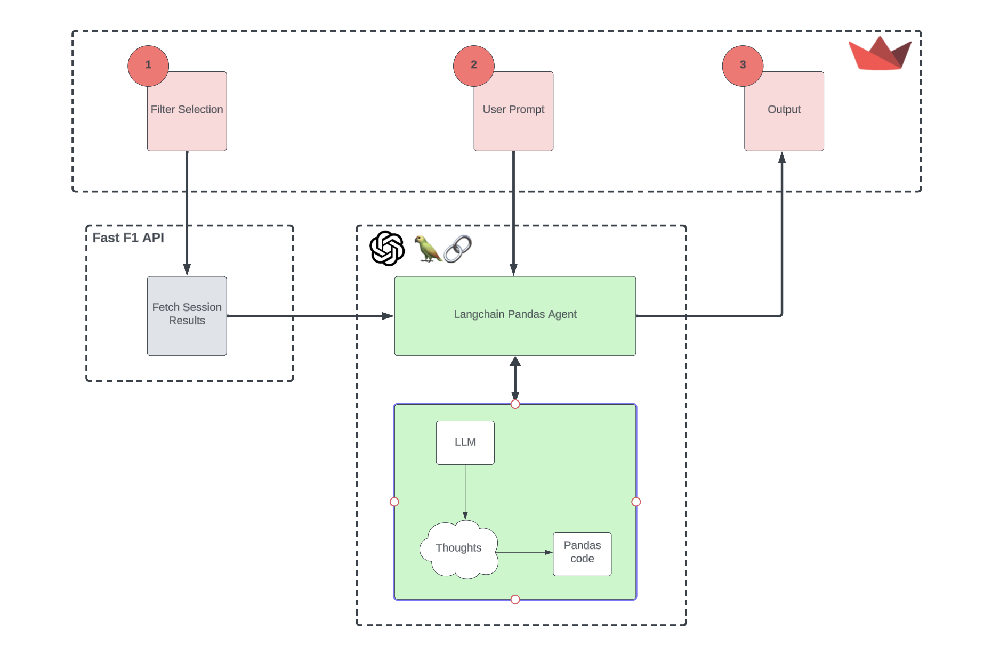

# F1 Wiz : Insights powered by LLMs and LangChain


Intrigued by the electrifying world of Formula One, my journey into the realm of F1 data analysis began with an unexpected catalyst. Yep, you guessed it – It all started with a Netflix series 'Drive to Survive’. I soon realised that F1 is more than just a sport; it's a crazy mix of human performance at its peak and mind-boggling engineering and Tech wizardry.

What makes it even more fascinating is that a modern-day F1 car is equipped with over 300 sensors, collecting massive amounts of data on the race, car, and driver performance. This abundance of data provided fertile ground for exploration, and with the recent rise of Large Language Models (LLMs), I decided to create a simple [Streamlit app](https://f1-wiz.streamlit.app/) that explores F1 data using their enhanced capabilities. 

## High Level Flow Diagram



Bird’s eye view of the app

This F1 app operates on three main components:

1. Streamlit: Serving as the user-facing interface, Streamlit allows users to input specific F1 session filters, facilitates interactions, and hosts the chat interface.
2. Fast F1 API: The data source responsible for retrieving the requested Formula 1 data.
3. Chat GPT & LangChain: Leveraging ChatGPT as the Large Language Model (LLM) and the LangChain Pandas agent, this duo handles prompt processing, Pandas code generation, data retrieval, and ultimately produces the output answers.

## Key Sections of the Code

Feel free to explore the complete code on the [repo](https://github.com/tanul-mathur/f1-wiz), but here are some highlights:

### Fast F1 API interaction

I've utilised the **`get_session()`** method from the Fast F1 API, and it neatly arranges session results into a pandas dataframe. This dataframe is packed with useful information about the drivers, teams, finishing positions, points, laps, and time. 

```python
import fastf1 as ff1

####### LOAD THE APP
session = ff1.get_session(year, event_name, session_name)
session.load()
results_df = session.results
```

### LangChain Agent Setup

When it comes to analysing data with LLMs, we've got a few options like LlamaIndex SimpleDirectoryloaders, LangChain CSV loaders, and more. But in my experience, the LangChain pandas agent is the best for working with dataframes. It lets us easily reference a particular dataframe and even add a 'prefix' to give it some context. I used this feature to provide general F1 info and descriptions for table columns.

```python
prefix_prompt = f'''You are working with pandas dataframes in Python that contain Formula One race results and lap details. The dataframe is called 'df'.
{data_schema} 
You are an expert in Formula One and know all about the sport.

You should use the tools below to answer the question posed of you:

python_repl_ast: A Python shell. Use this to execute python commands. Input should be a valid python command. When using this tool, sometimes output is abbreviated - make sure it does not look abbreviated before using it in your answer. Install all required libraries.
'''

openai_api_key = st.sidebar.text_input("OpenAI API Key", type="password")

llm = ChatOpenAI(
    temperature=0, model="gpt-3.5-turbo-0613", openai_api_key=openai_api_key, streaming=True
)

pandas_df_agent = create_pandas_dataframe_agent(
    llm,
    df = results_df,
    verbose=True,
    agent_type=AgentType.OPENAI_FUNCTIONS,
    handle_parsing_errors=True
    ,prefix = prefix_prompt
)
```

## Example Questions

I was genuinely amazed by the agent's comprehension skills. It not only figures out the correct Pandas code to filter the dataframe but also excels at understanding the question's context and selecting the appropriate column names. Here are some remarkable examples:

1. "How many drivers finished the race?" - It automatically recognises the 'Status' column as the right indicator of race completion and generates the necessary Pandas code to find the answer.
2. "Who are the drivers on the podium?" - This one truly impressed me. There's no mention of 'podium' in the documentation or syntax, yet it successfully identifies the top 3 drivers from the race.
3. "How many British drivers participated in the race?" - I was amazed by its ability to grasp the broader context, recognising 'Britain' as 'GBR.'

However, it's worth noting that there's room for improvement. Here are a couple of tricky questions that posed a challenge:

1. "How many drivers were eliminated?"
2. "Which drivers finished last?"

## Next Steps

Although this was a great start, the app is just a glimpse of what's possible. There are several exciting possibilities I'd like to explore next: 

- **Multiple Dataframes**: Imagine giving the agent a list of dataframes instead of just one. This could significantly broaden its knowledge base.
- **Chat History**: The capability to retain chat history and context would be incredibly valuable. It could facilitate deeper investigations and more engaging conversations.
- **Visualisations**: It would be great to have the agent provide visualisations alongside text responses, not limiting it to just textual output.

## Conclusion

In summary, it was a delightful experience to explore these features within the confines of a basic app. I encourage everyone to give it a try and share your experiences and feedback. We're living in incredibly exciting times, and I truly believe it would be a missed opportunity not to explore these new frontiers.

## References

- [Fast F1 API](https://docs.fastf1.dev/examples/index.html)
- [Langchain Pandas Agent](https://python.langchain.com/docs/integrations/toolkits/pandas#using-openai-functions)
- [Streamlit Docs](https://docs.streamlit.io/library/api-reference)
- [Unlocking Context-Aware Insights in Tabular Data with LLMs and LangChain - Ameer Hakme](https://ameer-hakme.medium.com/unlocking-context-aware-insights-in-tabular-data-with-llms-and-langchain-fac1d33b5c6d)
- [Build a chatbot with custom data sources, powered by LlamaIndex](https://blog.streamlit.io/build-a-chatbot-with-custom-data-sources-powered-by-llamaindex/)